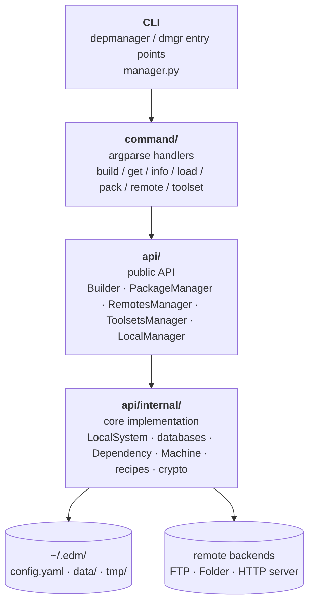
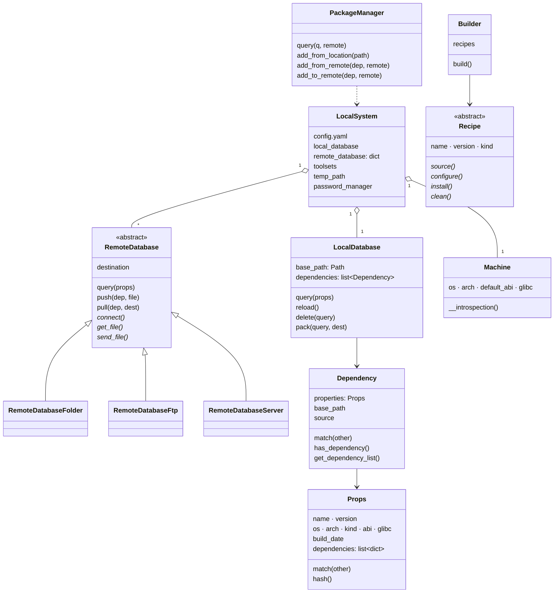
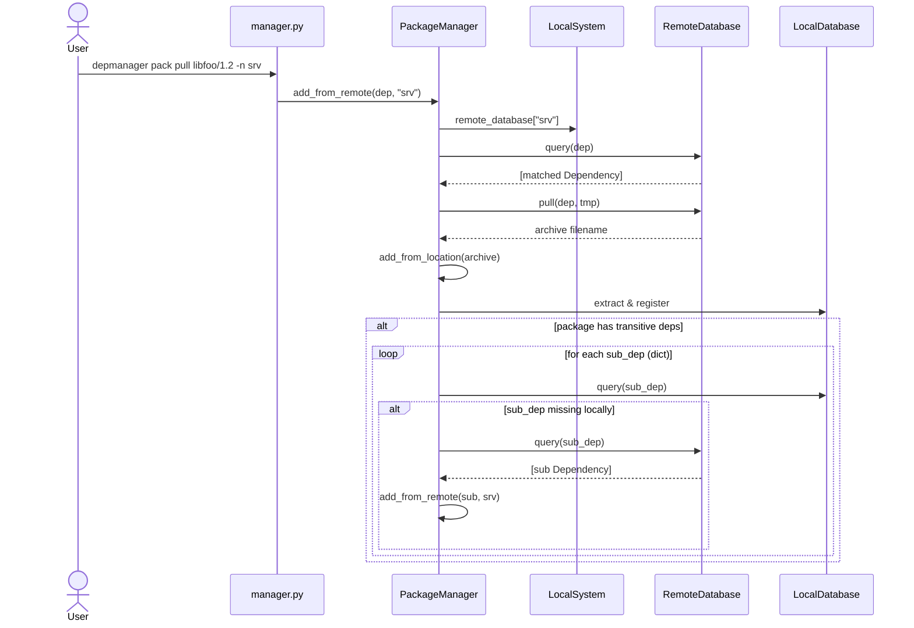
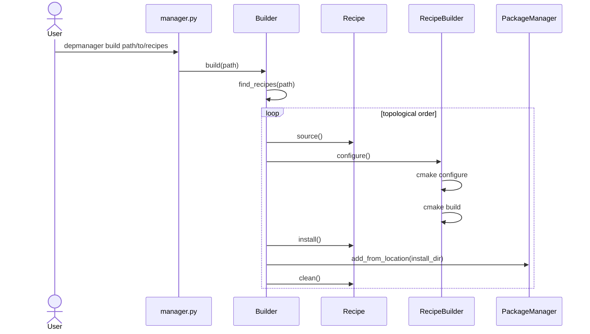
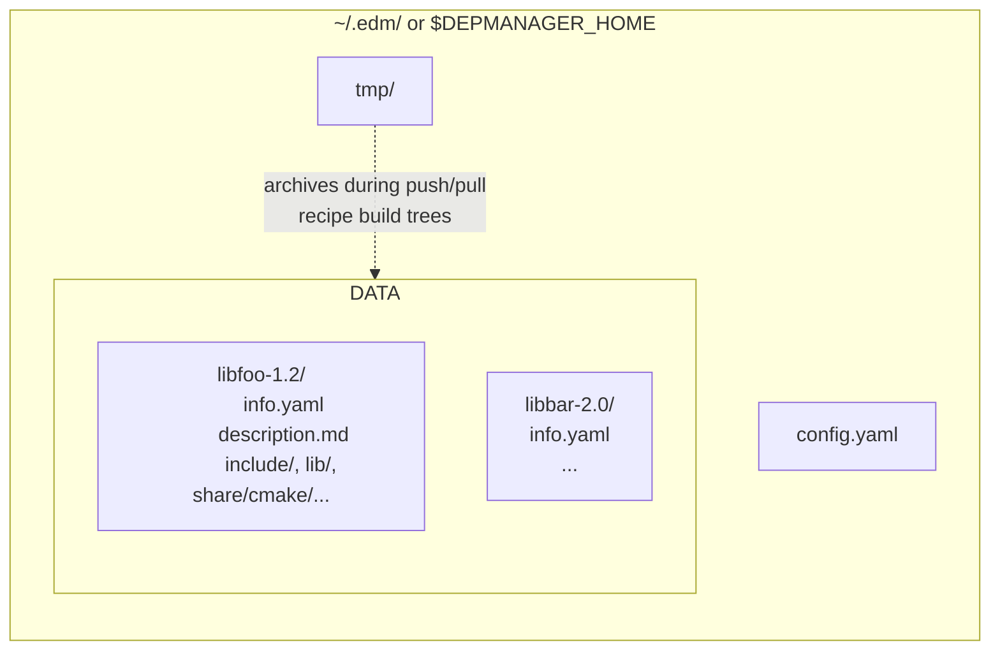

# Architecture

This document describes DepManager's internal structure. For an end-user
overview, see the top-level [`README.md`](../README.md).

## Layered structure

DepManager is organised in three layers. Callers only ever reach down by one
level: `command/` uses `api/`, and `api/` uses `api/internal/`. Nothing in
`api/internal/` should reach back up.

`manager.py` composes the CLI by registering each subcommand's
`add_*_parameters()` function, then dispatches to the matching handler with a
parsed `argparse.Namespace` and a ready `LocalManager`.

## Core collaborators

### Responsibilities

- **`LocalSystem`** (`api/internal/system.py`) is the session-scoped singleton.
  Everything — databases, toolsets, temp paths, credentials — is reached
  through it. This is also where file locking for concurrent `depmanager`
  invocations lives.
- **Databases** (`api/internal/database_*`) share the `__DataBase` matching
  contract. `query` accepts a dict, string, `Props`, or `Dependency` and
  returns a list of `Dependency`. Remote variants add `push`/`pull` over the
  transport they implement (FTP, filesystem copy, HTTP).
- **`Props`** is the matching primitive. Wildcards use `fnmatch`; version
  comparison is numeric-aware (`1.10` > `1.2`) via `safe_to_int`; glibc has
  three matching modes (`=X.Y` exact, `X.Y` "this host can run X.Y-built
  packages", `any`/`*`/empty wildcard).
- **`Dependency`** wraps `Props` with filesystem awareness (base path,
  `cmake_config_path` discovered by globbing `*onfig.cmake`).
- **`Machine`** introspects `platform.*` once on first use. Unknown OS or arch
  calls `exit(666)` — see [contributing](contributing.md) if you're adding a
  platform.

## Package metadata format

Each package on disk lives in a directory under `~/.edm/data/` containing:

- `info.yaml` — `Props` serialised as YAML. This is the authoritative metadata
  file since the move from the legacy `edp.info` format (still read on load
  and upgraded on first access).
- `description.md` *(optional)* — free-form package description.
- The actual CMake-installed tree (include/, lib/, share/cmake/…).

Archives (`.tgz` / `.zip`) used for transport mirror this layout.

## Sequence: `depmanager pack pull`

The transitive loop resolves dicts coming out of
`Dependency.get_dependency_list()` to full `Dependency` objects via
`remote.query()` **before** recursing — passing the raw dict would crash the
recursive call on `dep.properties.hash()`.

## Sequence: `depmanager build`

## Configuration file (`depmanager.yml`)

`ConfigFile` parses project-level YAML used by the CMake integration. The two
recognised top-level keys are `remote` (server info + pull policy) and
`packages` (what the project wants loaded). See the end-user README for field
definitions.

## Data on disk

`DEPMANAGER_HOME` overrides `~/.edm/` — used by the test suite
(`tmp_edm_home` fixture) to keep tests isolated.
