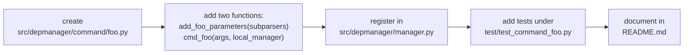

# Contributing

## Local setup

```bash
# From the repository root
poetry install               # creates .venv/ with dev deps (pytest, twine)
poetry shell                 # activate, or prefix commands with `poetry run`
```

Python >= 3.9 is required. The project pins `cryptography == 46.0.5` — if
pip complains, check your Python version first.

## Running tests

```bash
poetry run pytest                            # full suite
poetry run pytest -k match                   # filter by keyword
poetry run pytest test/test_dependency.py    # one file
poetry run pytest -q --no-header             # quieter
```

All tests live under `test/`. The conventions:

- **Isolation** — use the `tmp_edm_home` fixture (defined in
  `test/conftest.py`) whenever a test needs a `DEPMANAGER_HOME`. Never let a
  test touch the real `~/.edm/`.
- **Fake collaborators over mocks** — see
  `test/test_package_add_from_remote.py` for the pattern: small fake classes
  with just the methods the unit under test calls. This beats `unittest.mock`
  for readability.
- **Integration where cheap** — `test/test_local_database.py` builds real
  on-disk packages via the `make_package` fixture; faster than mocking and
  catches filesystem-layout bugs.
- **Parametrise boundaries** — version comparisons, fnmatch edges, format
  helpers. See `test_version_lt` for the style.

What is *not* currently covered and would be welcome:

- Remote HTTP/FTP backends (need response fixtures).
- Recipe build lifecycle (needs a fake toolset).
- `LocalSystem` full-config round-trip.

## Coding conventions

- **Formatting** — Black, 88-char line limit. Run `poetry run black src test`.
- **Naming** — `snake_case` for variables/functions, `PascalCase` for classes,
  `UPPER_SNAKE` for module-level constants.
- **Types** — type hints on all new public functions. `from __future__ import
  annotations` is OK for tests; the main package targets 3.9+, so avoid `X |
  Y` union syntax in shipped code.
- **Docstrings** — reST style (`:param foo:`, `:return:`). Keep them short.
- **Paths** — always `pathlib.Path`, never `os.path`.
- **Logging** — `from depmanager.api.internal.messaging import log`, then
  `log.debug/info/warn/error/fatal`. No bare `print` in shipped code.
- **Secrets** — use `PasswordManager`; never log or serialise plaintext
  credentials. Sensitive files are created with `0o600`.
- **Error handling** — return `False` / `None` on expected failure. Raise only
  for bugs and unrecoverable states.

## Imports

- `api/internal/` modules use fully-qualified imports
  (`from depmanager.api.internal.messaging import log`).
- Modules **outside** `api/internal/` use the shortened form
  (`from api.internal.system import LocalSystem`) — this is enforced by the
  packaging layout, don't "fix" it.

## Adding a CLI command



## Release checklist

1. Bump the version in `pyproject.toml` (`[tool.poetry] version`).
2. Run the full test suite — must be green.
3. Run `poetry run black --check src test`.
4. Update the top-level `README.md` if user-visible behaviour changed.
5. Build: `poetry build` — check `dist/` contents.
6. Tag and push: `git tag vX.Y.Z && git push --tags`.
7. Publish: `poetry run twine upload dist/*`.

## Reporting bugs

File issues at <https://github.com/Silmaen/DepManager/issues> with:

- DepManager version (`depmanager info version`)
- Host OS / arch / Python version
- Full command invocation
- Relevant traceback (run with `DEPMANAGER_LOG_LEVEL=DEBUG` if you can)
