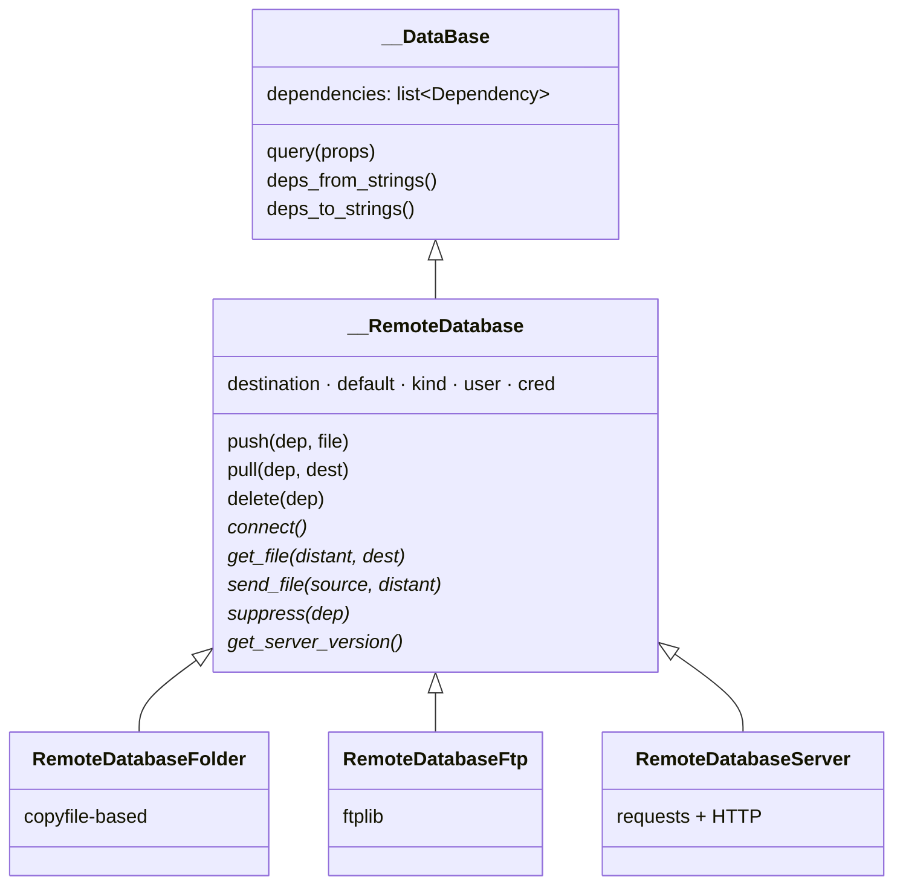
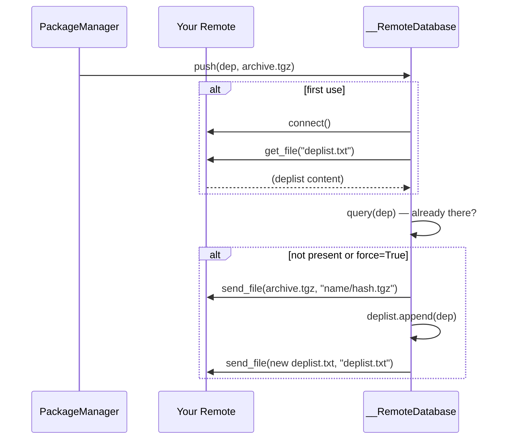

# Extending Remotes

DepManager ships three remote backends: filesystem folder, FTP, and a custom
HTTP server ([DepManagerServer](https://github.com/Silmaen/DepManagerServer)).
Adding a new one means subclassing `__RemoteDatabase` and implementing the
transport primitives — DepManager handles the query / push / pull orchestration
on top.

## Contract overview



Methods marked `*` are the only ones you must implement; everything else is
inherited.

## The primitives

| Method | Must do | Failure mode |
|---|---|---|
| `connect(self)` | Establish any session, ensure `deplist.txt` is readable, set `self.valid_shape = True`. | Set `self.valid_shape = False` and log — do not raise. |
| `get_file(self, distant_name, destination)` | Download `distant_name` into the `destination` directory (create it if needed). | Leave destination untouched and return silently. |
| `send_file(self, source, distant_name)` | Upload the local `source` file to `distant_name` on the remote. | Log and return; the caller will notice via `deplist` mismatch. |
| `suppress(self, dep)` | Remove the dependency's archive from the remote. | Return `False`. |
| `get_server_version(self)` | Return a string identifying the backend version. | Return `"unknown"` if the remote has no version concept. |

### What the base class handles

`__RemoteDatabase` provides, for free:

- **Lazy init**: `query()` calls `__initialize()` on first use, which calls
  your `connect()` then `get_dep_list()` (reading `deplist.txt` through
  `get_file`).
- **Push / pull flow**: `push(dep, file)` refuses duplicates unless `force=True`,
  then calls `send_file()` and re-syncs the deplist. `pull(dep, dest)` resolves
  the `Dependency` via `query()` then calls `get_file()` on the computed
  archive path (`{name}/{hash}.tgz`).
- **Delete flow**: `delete(dep)` runs your `suppress()` and updates the deplist.

## Skeleton

```python
# src/depmanager/api/internal/database_remote_cool.py
from pathlib import Path

from depmanager.api.internal.database_common import __RemoteDatabase
from depmanager.api.internal.messaging import log


class RemoteDatabaseCool(__RemoteDatabase):
    """Custom remote backend over the Cool protocol."""

    def __init__(self, destination: str, default: bool = False,
                 user: str = "", cred: str = ""):
        super().__init__(
            destination=destination,
            default=default,
            user=user,
            cred=cred,
            kind="cool",
        )
        self.remote_type = "Cool"
        self.version = "1.0"

    def connect(self):
        try:
            # open the session, check access, etc.
            self._client = CoolClient(self.destination, self.user, self.cred)
            self.valid_shape = True
        except Exception as err:
            log.warn(f"Cool connect failed: {err}")
            self.valid_shape = False

    def get_file(self, distant_name: str, destination: Path):
        destination.mkdir(parents=True, exist_ok=True)
        try:
            self._client.download(distant_name, destination / Path(distant_name).name)
        except Exception as err:
            log.warn(f"Cool get_file {distant_name}: {err}")

    def send_file(self, source: Path, distant_name: str):
        if not source.is_file():
            return
        try:
            self._client.upload(source, distant_name)
        except Exception as err:
            log.warn(f"Cool send_file {distant_name}: {err}")

    def suppress(self, dep) -> bool:
        target = f"{dep.properties.name}/{dep.properties.hash()}.tgz"
        try:
            self._client.delete(target)
            return True
        except Exception as err:
            log.warn(f"Cool suppress {target}: {err}")
            return False

    def get_server_version(self):
        return self.version
```

## Registering the backend

Remotes are instantiated from `config.yaml` entries based on the `kind`
field. Wire your class into the factory so users can `depmanager remote add
--url cool://...`:

1. Pick a URL scheme (e.g. `cool` / `cools`).
2. Extend the scheme dispatch in `LocalSystem` (look for how `srv` / `srvs` /
   `ftp` / `folder` are mapped — add your branch there).
3. If you need credentials, surface them in
   `command/remote.py::add_remote_parameters()` and pass them through to the
   constructor.

## Sequence: `push`



## Testing a new backend

- Unit-test `connect`, `get_file`, `send_file` against an in-memory double of
  your transport (see the existing Folder backend as an example — it uses
  `shutil.copyfile` so the tests barely need any infrastructure).
- Integration-test via a real server in a CI container when the transport has
  stateful behaviour (HTTP, FTP).
- Use the `tmp_edm_home` fixture from `test/conftest.py` so the test's local
  side is isolated.

## Things to avoid

- Don't raise from the primitives — the base class relies on `valid_shape` to
  short-circuit subsequent calls. Swallow, log, and return.
- Don't cache `Dependency` objects across `reload()`-style calls; the deplist
  is the single source of truth.
- Don't write to `~/.edm/` from inside a remote implementation — that's the
  local database's job. Your job is transport.
