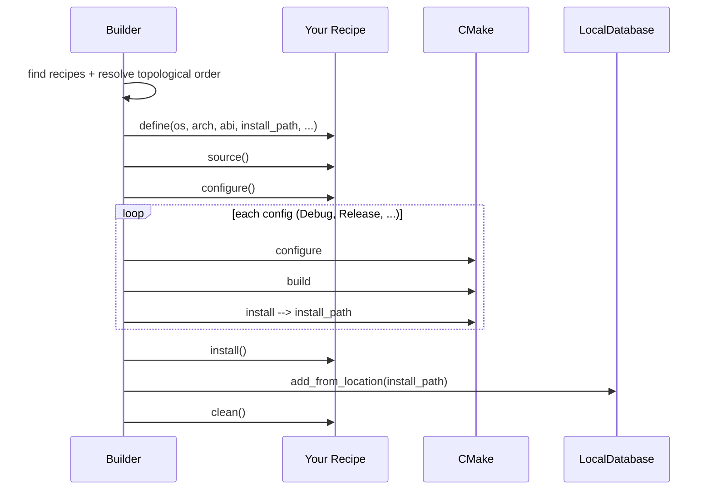

# Writing a Build Recipe

A *recipe* is a Python class that tells DepManager how to fetch sources,
configure CMake, and install a C++ package. `depmanager build` loads recipes
from a directory and runs them in dependency order.

## Minimal recipe

A recipe is any subclass of `Recipe` (from `depmanager.api.recipe`) exposing
the right class-level attributes.

```python
# libfoo_recipe.py
from pathlib import Path
from depmanager.api.recipe import Recipe


class Libfoo(Recipe):
    name = "libfoo"
    version = "1.2.3"
    kind = "static"                 # "static", "shared", or "header"
    source_dir = "src"              # where CMakeLists.txt lives after source()
    config = ["Debug", "Release"]   # build configs to produce

    public_dependencies = []        # exposed to library consumers
    dependencies = []               # private to the build

    cache_variables = {
        "LIBFOO_ENABLE_FOO": "ON",
    }

    description = "A small demo library."

    def source(self):
        # fetch / unpack / symlink sources under self.path / self.source_dir
        ...

    def configure(self):
        # optional — runs just before cmake configure
        ...

    def install(self):
        # optional — runs after cmake install, before packaging
        ...

    def clean(self):
        # optional — runs at the very end
        ...
```

Drop the file in a directory, then:

```bash
depmanager build path/to/recipes
```

DepManager scans the directory, imports each file, and collects every
`Recipe` subclass it finds.

## Lifecycle



The hooks you override (`source`, `configure`, `install`, `clean`) all default
to no-ops, so a recipe whose source fetch is handled outside and whose CMake
build needs no extra setup can stop after class attributes.

## Available context at build time

After `define()`, `self.settings` holds:

- `os`, `arch`, `abi` — target platform triple
- `install_path` — where CMake should install (a `Path`)
- `glibc` — only set when targeting Linux
- `build_date` — timezone-aware timestamp stamped into `info.yaml`

`self.path` is the directory containing the recipe file; use it as the base
for locating vendored sources or patches you ship next to the recipe.

## Declaring dependencies

```python
class Libbar(Recipe):
    name = "libbar"
    version = "2.0.0"
    kind = "shared"

    public_dependencies = [
        {"name": "libfoo", "version": "1.2.3", "kind": "static"},
    ]
```

- `public_dependencies` are re-advertised via the package's own `info.yaml`,
  so downstream consumers pick them up automatically.
- `dependencies` are private: required to build but not exposed.

Dependency entries are plain `dict` objects matching the `Props` schema
(`name`, `version`, optionally `os`/`arch`/`kind`/`abi`/`glibc`). Missing
fields are interpreted as "any".

## Platform-specific recipes

Gate the whole recipe — set `possible=False` in `__init__` when the target
platform cannot build this package; the Builder will skip it cleanly:

```python
class LibfooOnLinux(Recipe):
    name = "libfoo"
    version = "1.2.3"
    kind = "static"

    def __init__(self, path=None, possible=True):
        super().__init__(path=path, possible=possible and _host_is_linux())
```

## Tips

- Keep `source()` idempotent — the Builder may re-enter it after a partial
  failure.
- Use `cache_variables` for anything CMake needs across reconfigures; the
  Builder passes them through as `-D` arguments.
- If you vendor a patch next to the recipe, resolve it via `self.path /
  "patches" / "fix.patch"`. Don't hardcode absolute paths.
- Recipes are ordinary Python — you can share helpers across them via a
  sibling module in the same recipes directory.

## Debugging a recipe

```bash
# Build one recipe, keep intermediate directories for inspection
depmanager build --keep path/to/recipes --filter libfoo

# Increase verbosity
DEPMANAGER_LOG_LEVEL=DEBUG depmanager build path/to/recipes
```

Intermediate build trees land under `$DEPMANAGER_HOME/tmp/` — safe to delete
at any point.
